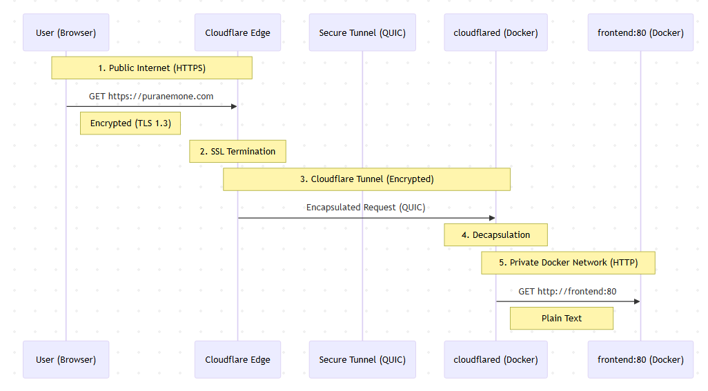
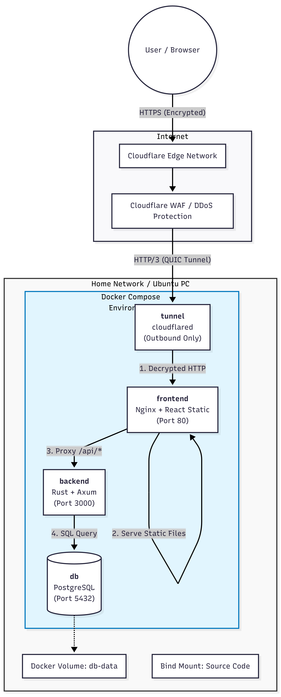

# ToDo
DBのセキュリティ設定

node.jsの定期的な更新など pull

アプリ用のユーザは開発用と分けた方がいい(DB): 基本操作（SELECT, INSERT, UPDATE, DELETE）のみ

隠し要素

ユーザのIPアドレスとか保存したい


管理画面あった方が不適切書き込み削除しやすい

いいね機能とかつけたい

ubutnuのwakeonlanはやった方がいいとは思ってる

開発用のDBとかテスト用のDBとか本番用のDBを分けた方がいいことは知ってる

rust側定数（レート制限の秒数、キャッシュのTTL、Cookieの有効期限など）がコード内に散らばっているので、config.rs モジュールを作成し、環境変数（env）またはデフォルト値から設定構造体を読み込むようにする。


## その他メモ
ユーザはクッキーの情報を元に認証
今回は互いのデータが干渉することがないから、データのアトミック性を考えていない

- フォルダの所有者を自分に
```
sudo chown -R $USER:$USER <folder>
```

### クッキー消せばDDoSできる状態だった
nginx.conf:
```conf
// 同じ大学構内等だと複数人が同一になる可能性がある
// 同一IPからのアクセスを平均10回/sまでに制限
limit_req_zone $binary_remote_addr zone=api_limit:10m rate=10r/s;
// location内
	// 同一IPからのアクセス(最大瞬間風速)を20回/sまでに制限
	limit_req zone=api_limit burst=20 nodelay;
```

- rust側

書き込み(3秒に一回)、読み込み(1秒に一回)のレート制限を設けることによってDBを保護
現在はバックのリポジトリで全件取得は100件までに制限している

## 技術メモ
### docker conpose
environmentに渡した変数は、環境変数となる
```bash
# 以下のような形で受け取れる
echo $DATABASE_URL
```

サービス間での通信（Compose 内のネットワーク）は、ポートを公開していなくても コンテナ名で接続可能
だからポートを開放してない

compose.override.yaml: 開発時のみ設定を上書きする仕組み
```ts
// 開発時はnginxがいないためAPIリクエストの転送をViteにやらせるため vite.config.tsに以下を追記
server: {
	// Docker内からのアクセス許可
	host: '0.0.0.0',
	port: 80, 
	allowedHosts: ['puranemone.com'],
	// APIプロキシ設定 (Nginxの代わり)
	proxy: {
		'/api': {
			target: 'http://backend:3000',
			changeOrigin: true,
			rewrite: (path) => path.replace(/^\/api/, ''),
		},
	},
},
```

### マルチステージ
Dockerfile内で複数のステージを使って、ビルド環境と実行環境を分ける手法
Rustはビルドに、Rustコンパイラやcargo、依存クレートが必要だが
最終的にはコンパイル済みバイナリだけで十分
```docker
# ビルド済みバイナリだけコピー
COPY --from=builder /app/target/release/server /usr/local/bin/server
```

### Makefile
定型shell操作の正式化
*.shと比較して、いくつかのターゲットを指定可能
各行が別shellで実行される
```makefile
bad:
	cd backend
	cargo build   # ← 別shellなので失敗
good:
	cd backend && cargo build
```

以下のシェルを動くようにした
```bash
# 開発環境
make dev
# 本番環境(反映)
make prod
# 停止
make down
# ログ監視
make logs
# DBコンテナ接続
make dbshell
# バックのコンテナ接続
make backendshell
# フロントのコンテナ接続
make frontendshell
```

### 開発
container dev: VSCodeの拡張機能でコンテナ内部環境で開発可能に

# ビルド
```bash
# 開発モード
docker compose up -d --build
# 本番ビルド(compose.overrride.yamlを無視)
docker compose -f compose.yaml up -d --build
```

特定のものだけリスタート
```bash
docker compose restart frontend
```

# コンテナに接続
## フロント
EXPOSE 80
```bash
docker exec -it puranemone_frontend /bin/sh
```

- nginx.conf(Webサーバー兼リバースプロキシ)の設定反映
```bash
# テスト
nginx -t
# リロード
nginx -s reload
```

- // 環境構築時
```bash
# Frontendの初期化
docker run --rm \
  -v $(pwd)/frontend:/app \
  -w /app \
  node:20-alpine \
  sh -c "npm create vite@latest . -- --template react-ts && npm install"
```
- サーバー接続確認
```bash
curl -v -c cookie.txt -X POST http://backend:3000/api/calligraphy -H "Content-Type: application/json" -d '{"content": "初回：テスト書き初め"}'
```

## バック
EXPOSE 3000
```bash
docker exec -it puranemone_backend /bin/sh
```

- // 環境構築時
```bash
# Backendの初期化とライブラリ追加
docker run --rm \
  -v $(pwd)/backend:/app \
  -w /app \
  rust:1.83-slim-bookworm \
  sh -c "cargo init --name server && cargo add axum tokio --features tokio/full serde serde_json"
```
簡易サーバ
```rust
use axum::{
	routing::get,
	Router,
};
use std::net::SocketAddr;

#[tokio::main]
async fn main() {
	// ルーティング設定: ルート(/) にアクセスが来たら文字列を返す
	let app = Router::new().route("/", get(|| async { "Hello from Rust Backend!" }));

	// Docker内では 0.0.0.0 でリッスンしないと外部(Nginx)から繋がらない
	// 127.0.0.1 だとコンテナ内部に閉じこもってしまうため注意
	let addr = SocketAddr::from(([0, 0, 0, 0], 3000));
	
	println!("Listening on {}", addr);
	
	// サーバー起動
	let listener = tokio::net::TcpListener::bind(addr).await.unwrap();
	axum::serve(listener, app).await.unwrap();
}
```

- フォーマッタ
```bash
rustup component add rustfmt
```

- 概念

[起動時]
Main -> Service(実体) -> Repository(実体) -> PgPool(実体: 接続数5)

[リクエストA]
Handler A -> Service(参照) -> Repository(参照) -> PgPool(参照) -> (実体のPgPoolを使う)


- --nocapture

テストでのprintln!()を出力する

- サーバ動作確認(サーバ内)
```bash
curl -v -c cookie.txt \
  -X POST http://backend:3000/api/calligraphy \
  -H "Content-Type: application/json" \
  -d '{"user_name": "Test User", "content": "初回：テスト書き初め"}'
```
- 返答
```bash
# curl -v -c cookie.txt \
  -X POST http://backend:3000/api/calligraphy \
  -H "Content-Type: application/json" \
> > >   -d '{"user_name": "Test User", "content": "初回：テスト書き初め"}'
Note: Unnecessary use of -X or --request, POST is already inferred.
*   Trying 172.18.0.4:3000...
* Connected to backend (172.18.0.4) port 3000 (#0)
> POST /api/calligraphy HTTP/1.1
> Host: backend:3000
> User-Agent: curl/7.88.1
> Accept: */*
> Content-Type: application/json
> Content-Length: 71
>
< HTTP/1.1 200 OK
< content-type: application/json
* Added cookie calli_user_id="c0459e36-f443-4e26-bdee-c3f6b443b2d7" for domain backend, path /, expire 1798459460
< set-cookie: calli_user_id=c0459e36-f443-4e26-bdee-c3f6b443b2d7; HttpOnly; SameSite=Lax; Path=/; Max-Age=31536000
< content-length: 215
< date: Sun, 28 Dec 2025 12:04:20 GMT
<
* Connection #0 to host backend left intact
{"user_id":"c0459e36-f443-4e26-bdee-c3f6b443b2d7","user_name":"Test User","content":"初回：テスト書き初め","created_at":"+002025-12-28T12:04:20.422350000Z","updated_at":"+002025-12-28T12:04:20.422350000Z"}
```

## DB
```bash
docker exec -it puranemone_db /bin/sh
```

- 基本操作
```postgreSQL
-- DB一覧
\l
-- DB切り替え
\c <db>
-- テーブル一覧
\dt
-- テーブル定義取得
\d <table>
-- 権限表示
\du
-- whoami
SELECT current_user;
```

- 初期セットアップ
```postgreSQL
-- ユーザ作成
CREATE USER <user> WITH PASSWORD <password>;
-- データベース作成
CREATE DATABASE <db> OWNER <user>
-- 権限付与
GRANT ALL PRIVILEGES ON DATABASE <\db> TO <user>;
```
- 操作ログイン
```bash
psql -h localhost -p 5432 -U <user> -d <db>
```


PostgreSQLは ポート5432を開放
```
# 接続
DATABASE_URL=postgres://<user>:<password>@<host>:5432/<db>
```

### 接続テスト
```bash
# 外部から
curl -v https://puranemone.com
# ローカルから
curl -v http://localhost
```

# ユーザの接続図


# 構成図
